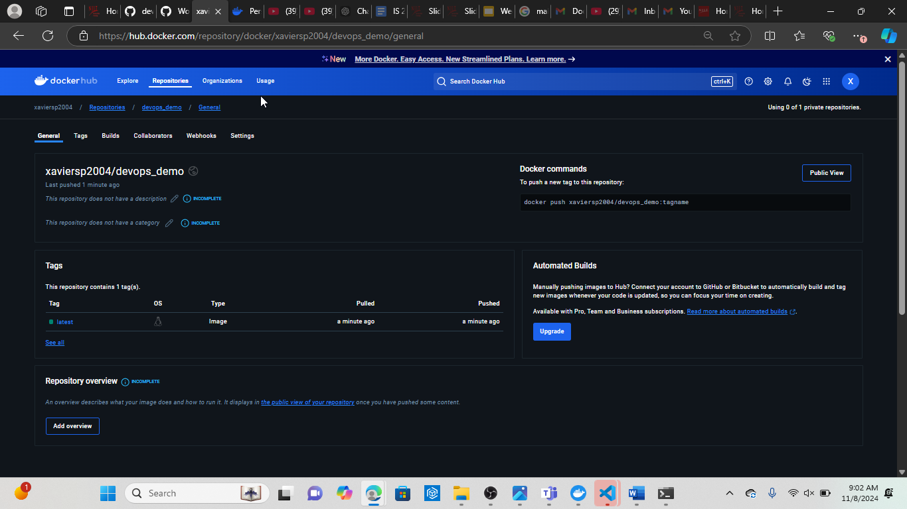

# Devops - Automated Builds Pushing to DockerHub Intro

For this assignment I want you to watch the following two videos and create your own GitHub Repo from scratch based on this repository.   You will learn to setup a GitHub Action to implement a CI/CD workflow to automaticly test, build and push your program's image to Dockerhub.  Add screen shots to this readme file where indicated that show the image published in your Docker hub account. 

## Instructor Videos:

1. [Important Docker Commands to Know](https://youtu.be/B26ecGh8tMw)
2. [Automated Builds Complete Demo](https://youtu.be/PZVT1IOC0Zo)
**Note:  I changed the code a little in my workflow to use an improved approach versus whats in the video I separated the jobs and used "needs" to require the test job to complete first**

## Instructions

1. Log in to your Docker and [DockerHub accounts](https://hub.docker.com/)

2. Follow my code to create a new repo on Github.

3. Generate you [Docker personal access token](https://app.docker.com/settings/personal-access-tokens).

4. Update the `.github/workflows/production.yml` file.

5. Set up Github actions environment variables.

    1. Go to [Your github repo] → Settings → Environments

    2. Add a new environment named `production`.

    3. Add two Environment secrets to `production`: 
        - `DOCKERHUB_USERNAME`
        - `DOCKERHUB_TOKEN`

6. Push your code to Github.

7. After the Gihub actions workflow is successful, take a screenshot of your DockerHub account.

## Requirement

1.  Put the screenshot of your Docker image in your [DockerHub account](https://hub.docker.com/)  here.

For example (change it to yours):

